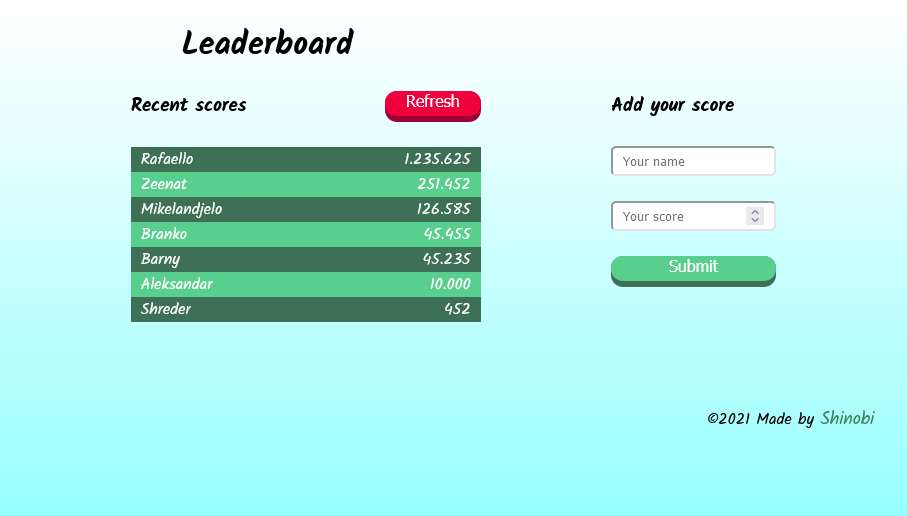

# Leaderboard

> The leaderboard website displays scores submitted by different players. It also allows you to submit your score..



Additional description about the project and its features.

## Built With

- HTML 5
- CSS 3
- JavaScript

## Live Demo

[Live Demo Link](https://shinobiwarior.github.io/Leaderboard/)


## Getting Started

To get a local copy up and running follow these simple example steps.

### Prerequisites

- Node.js
- npm
### Setup

Clone the repository with:

```
git clone git@github.com:ShinobiWarior/Leaderboard.git
```
or download [ZIP file](https://github.com/ShinobiWarior/Leaderboard/archive/refs/heads/dev.zip)

### Install
To install all dependancies run:
```
npm install --save-dev webpack webpack-cli webpack-dev-server html-webpack-plugin style-loader css-loader 
```
### Usage
To use the application run the next commands:
```
npm run build

npm run start
```
## Author

👤👤 **Aleksandar Ivezic**

- GitHub: [@Aleksandar Ivezic](https://github.com/ShinobiWarior)
- Twitter: [@AIvezic](https://twitter.com/AIvezic)
- LinkedIn: [Aleksandar Ivezic](https://www.linkedin.com/in/aleksandar-ivezic/)

## 🤝 Contributing

Contributions, issues, and feature requests are welcome!

Feel free to check the [issues page]([issues](https://github.com/ShinobiWarior/Leaderboard/issues)/).

## Show your support

Give a ⭐️ if you like this project!

## Acknowledgments

- This project was inspired by [Microverse](https://www.microverse.org/?grsf=w9rx3c)

## 📝 License

This project is [MIT](lic.url) licensed.
